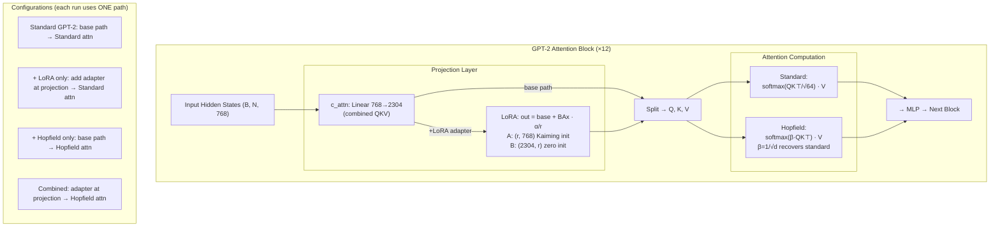

# LoRA + Hopfield Attention on DREADDIT — From-Scratch Reimplementation

Reimplementing [LoRA](https://arxiv.org/abs/2106.09685) (Hu et al., 2021) and [Modern Hopfield Networks](https://arxiv.org/abs/2008.02217) (Ramsauer et al., 2020) in pure PyTorch, applied to binary stress classification on [DREADDIT](https://huggingface.co/datasets/andreagasparini/dreaddit) (2,838 training examples, 715 test samples) using GPT-2 small (124M parameters). Trained on AMD Radeon RX 6700S via ROCm 6.2.

**Phase 2** of a [30-day AI/ML portfolio sprint](https://github.com/RRobin711). Phase 1 (a clinical RAG system) is at [huggingface.co/spaces/RRobin711/clinical-rag](https://huggingface.co/spaces/RRobin711/clinical-rag).

---

## Results

### Summary (single seed=42, n=715 test samples)

| Model | Trainable Params | % of Total | Test Acc | Test F1 |
|---|---|---|---|---|
| LoRA r=32 | 1,181,186 | 0.940% | 0.7664 | 0.7655 |
| Full fine-tune (lr=5e-6) | 124,441,346 | 100% | 0.7664 | 0.7640 |
| LoRA r=8 | 296,450 | 0.238% | 0.7427 | 0.7426 |
| LoRA r=8 + Hopfield β=1.0× | 296,450 | 0.238% | 0.7678 | 0.7662 |
| Hopfield β=1.0× default (frozen) | 1,538 | 0.0012% | 0.6811 | 0.6772 |
| Hopfield β=4.0× (frozen) | 1,538 | 0.0012% | 0.5427 | 0.5382 |

**Headline finding:** LoRA r=32 at 0.94% of parameters matches full fine-tuning at 100% (both 0.7664). Sharper attention (β=4.0×) on frozen representations drops accuracy by 13.8 points — the largest and most unambiguous effect in the project. The combined LoRA r=8 + Hopfield reaches 0.7678, but this +0.0014 gap is approximately one sample on n=715 and needs multi-seed validation. Full results in the ablation tables below.

### Hopfield β Ablation — Attention Sharpness on a Frozen Model

These runs use frozen GPT-2 with only the classification head trainable (1,538 params). This measures how sensitive a linear probe over frozen representations is to attention computation — not how a jointly trained model would respond to β changes.

| β Multiplier | Actual β | Test Acc | Test F1 | Δ vs Default | Best Epoch | W&B Run |
|---|---|---|---|---|---|---|
| 0.5× (softer) | 0.0625 | 0.6839 | 0.6777 | +0.0028 (noise) | 30 | dk2aap8a |
| 1.0× (default) | 0.125 | 0.6811 | 0.6772 | baseline | 30 | 3fx5qwm1 |
| 2.0× (sharper) | 0.25 | 0.6126 | 0.5985 | −0.0685 | 28 | g69ghczo |
| 4.0× (sharpest) | 0.5 | 0.5427 | 0.5382 | −0.1384 | 19 | lo3m611g |

The degradation at 2.0× (−6.9 points) and 4.0× (−13.8 points) is monotonic and far too large to be noise. The 0.5× improvement (+0.3 points) is within the noise floor. The directional pattern — sharper attention hurts on informal text — is suggestive of an analogy with Phase 1's HyDE finding, but at a different level of abstraction (see [Phase 1 Connection](#phase-1-connection)).

### LoRA Rank Ablation (30-epoch, early stopping, patience=3, seed=42)

| Config | Rank | Trainable Params | Trainable % | Test Acc | Test F1 | Best Epoch | W&B Run |
|---|---|---|---|---|---|---|---|
| Frozen baseline | 0 | 1,538 | 0.0012% | 0.6741 | 0.6730 | 30 | yq5x52zv |
| LoRA r=1 | 1 | 38,402 | 0.0309% | 0.6951 | 0.6951 | 30 | vuykn55l |
| LoRA r=4 | 4 | 148,994 | 0.1196% | 0.7259 | 0.7254 | 26 | 348htjeh |
| **LoRA r=8** | **8** | **296,450** | **0.2377%** | **0.7427** | **0.7426** | **18** | **3qh60b02** |
| LoRA r=16 | 16 | 591,362 | 0.4730% | 0.7538 | 0.7538 | 18 | g8mkyemx |
| LoRA r=32 | 32 | 1,181,186 | 0.9403% | 0.7664 | 0.7655 | 17 | pq2plsoj |
| LoRA r=64 | 64 | 2,360,834 | 1.8618% | 0.7650 | 0.7647 | 11 | 0pob6ww7 |
| LoRA r=128 | 128 | 4,720,130 | 3.6545% | 0.7692 | 0.7670 | 13 | ggr67mmv |

r=8 is the efficiency sweet spot: 0.24% of parameters, early stopping at epoch 18, 96.9% of r=32's accuracy. Returns diminish above r=32 — r=64 drops slightly (0.7650 vs 0.7664), consistent with mild overfitting at higher capacity on 2,838 examples.

**Note on the confounded first run:** The original 10-epoch ablation (no early stopping) showed every rank selecting epoch 10 as best, with r=128 reaching 0.7538 and accelerating gains through the highest rank — measuring training speed within a fixed budget, not model capacity. The corrected 30-epoch run above reveals the true diminishing-returns curve. Both runs are preserved: `results/ablation_epoch10_run/` (confounded) alongside the primary results.

---

## Key Findings

### 1. Sharper attention destroys frozen-model classification on informal text

The strongest and most unambiguous result. On frozen GPT-2 representations of DREADDIT, doubling attention sharpness (β=2.0×) drops accuracy by 6.9 points. Quadrupling it (β=4.0×) drops by 13.8 points to 0.5427 — barely above the 0.50 chance baseline. The effect is monotonic and definitive at n=715.

**Caveat:** These are frozen representations with a linear probe. The finding is about how attention sharpness affects feature extraction from frozen weights, not end-to-end model behavior. A β ablation on the combined LoRA+Hopfield model (where weights adapt) would test whether the effect persists under training.

### 2. LoRA r=32 replicates Hu et al.'s core claim on informal text

LoRA r=32 at 0.94% of parameters matches full fine-tuning at 100% (both 0.7664). This replicates the central finding of Hu et al. (2021) on a different domain — informal social media text vs. the NLU benchmarks in the original paper.

### 3. Ablation confound caught and corrected

The first ablation (10 epochs, no early stopping) showed every rank selecting epoch 10 — measuring training speed within a fixed budget, not model capacity. The confound was identified by examining the `best_epoch` column: uniform convergence at the epoch ceiling across all ranks, with accelerating gains that contradicted Hu et al.'s published diminishing-returns pattern. Rerun with early stopping produced the correct curve. Both result sets are preserved in the repo — the confounded run in `results/ablation_epoch10_run/`, the corrected run as the primary `results/ablation_*.json` files.

### 4. Full fine-tune LR confound

First attempt at lr=2e-5: best_epoch=2, train_loss≈0.04, test_acc=0.7566. Three interacting causes: LR 4× too high for 124M params, warmup (3 epochs) hadn't finished before early stopping fired at epoch 2, and 2,838 examples vs 124M parameters (~44K params/example) made memorization trivial. Fix: lr=5e-6 (Mosbach et al., 2021) → best_epoch=5, test_acc=0.7664. Both runs preserved: `full_finetune_s42.json` (bad) and `full_finetune_s42_lr5e-06.json` (canonical).

### 5. SDPA mask convention bug caught by pre-written test

GPT-2 SDPA: `True=attend, False=mask`. Standard PyTorch SDPA: `True=mask, False=attend`. Caught by TestBetaRecovery (written before the injection code existed) on first run. The test compares Hopfield output against standard attention at identical β — mask inversion produces different outputs, which the test flagged.

### 6. fp16 rejected after benchmarking

fp16 on RX 6700S: 30% Inf gradient rate from GradScaler, effective throughput 9% worse than fp32. Root cause: gfx1032→gfx1030 masquerade disables hipBLASLt. Decision: fp32 only. Details in `benchmarks/results/fp16_rocm_results.md`.

---

## Architecture



*If the Mermaid diagram doesn't render:* LoRA modifies the **projection weights** (what Q, K, V are computed from). Hopfield modifies the **attention computation** (how Q, K, V are combined). Each configuration uses one projection path and one attention path. They compose — the combined run uses LoRA projection + Hopfield attention simultaneously.

---

## Test Suite

146 tests, 47 classes, 8 files. All passing in 31.59 seconds. Tests were written incrementally alongside each module — every module was tested before being used in training.

| File | Tests | Coverage |
|---|---|---|
| test_lora.py | 31 | LoRAConfig, LoRALinear, from_linear, gradient flow, parameter counting |
| test_hopfield.py | 30 | HopfieldAttention, β scaling, energy function, numerical stability |
| test_hopfield_gpt2.py | 17 | GPT-2 injection, β recovery, causal masking, Conv1D compatibility |
| test_model.py | 26 | GPT-2 loading, Conv1D→Linear conversion, LoRA injection, parameter freezing |
| test_train.py | 14 | Training loop, early stopping, checkpoint save/load, W&B integration |
| test_evaluate.py | 10 | Metrics calculation, batch evaluation, edge cases |
| test_data.py | 9 | DREADDIT loading, tokenization, DataLoader configuration |
| test_combined_injection.py | 9 | Combined LoRA+Hopfield injection order, adapter trainability, backward pass |

---

## Environment and Tooling

| Component | Version / Detail |
|---|---|
| GPU | AMD Radeon RX 6700S (8GB VRAM, RDNA 2, gfx1032) |
| ROCm | 6.2.0 with HSA_OVERRIDE_GFX_VERSION=10.3.0, HSA_ENABLE_SVM=0 |
| Python | 3.12.3 |
| PyTorch | 2.5.1+rocm6.2 |
| OS | Ubuntu 24.04.4 LTS, kernel 6.8.0-101-generic |
| Package manager | uv 0.10.9 |
| Coding assistant | Claude Code (Opus 4.6) — constraints in [`CLAUDE.md`](CLAUDE.md) |
| Experiment tracking | [Weights & Biases](https://wandb.ai/ryanbinny711-/lora-hopfield-clinical?nw=nwuserryanbinny711) (23 runs) |

Claude Code wrote implementation code throughout the sprint, following a mandatory pre-implementation statement pattern: identify all failure modes before writing any line of code. Claude (chat) served as a review layer for architecture decisions and result interpretation. When the 30-epoch ablation crashed, Claude Code ran live system diagnostics and identified `HSA_ENABLE_SVM=0` as the fix — more precisely targeted than the chat layer's initial `HSA_ENABLE_SDMA=0` recommendation. The constraints, gotchas, and coding rules are public in CLAUDE.md.

Training on ROCm required four sessions of hardware debugging before any ML code was written: WSL2 ruled out (PCIe atomics), kernel 6.17 display failure (simpledrm built-in), kernel 6.8 downgrade and GRUB lock, then ROCm verification. The SVM page fault crash and fp16 rejection came later during training.

---

## Phase 1 Connection

Phase 1 found that HyDE helped on informal layperson queries by bridging vocabulary gaps, but hurt on expert queries where terminology already overlapped. Phase 2's β ablation shows an analogous pattern on frozen representations: sharper attention hurts on informal text. Both point toward the idea that informal language resists focused retrieval — but they operate at different levels (document embedding retrieval vs attention computation on frozen weights) and on different tasks. The connection is suggestive, not proven. A direct test would require varying β on a jointly trained model.

---

## Limitations

This project demonstrates engineering methodology on a small dataset — not a production system. Specific limitations: single seed throughout (no confidence intervals), small dataset (2,838 examples), β ablation on frozen representations only, and the combined model's +0.0014 accuracy advantage is within noise at n=715. The engineering methodology and the β degradation finding are what the project demonstrates — not the accuracy numbers.

---

## Project Structure

```
lora-hopfield-clinical/
├── src/
│   ├── __init__.py
│   ├── lora.py              # LoRAConfig + LoRALinear (Hu et al., 2021)
│   ├── hopfield.py          # HopfieldAttention (Ramsauer et al., 2020)
│   ├── hopfield_gpt2.py     # GPT-2 Hopfield injection
│   ├── model.py             # GPT-2 loading, Conv1D→Linear, LoRA injection
│   ├── data.py              # DREADDIT loading + tokenization
│   ├── train.py             # Training loop with early stopping
│   └── evaluate.py          # Test evaluation + metrics
├── tests/
│   ├── test_lora.py              # 31 tests, 8 classes
│   ├── test_hopfield.py          # 30 tests, 11 classes
│   ├── test_hopfield_gpt2.py     # 17 tests, 7 classes
│   ├── test_model.py             # 26 tests, 8 classes
│   ├── test_train.py             # 14 tests, 5 classes
│   ├── test_evaluate.py          # 10 tests, 4 classes
│   ├── test_data.py              # 9 tests, 2 classes
│   └── test_combined_injection.py # 9 tests, 2 classes
├── scripts/
│   ├── run_lora_ablation.py   # Rank ablation (frozen + r=1..128)
│   ├── run_hopfield.py        # Single Hopfield training run
│   ├── run_beta_ablation.py   # β ablation (0.5×..4.0×)
│   ├── run_lora_hopfield.py   # Combined LoRA + Hopfield
│   ├── run_full_finetune.py   # Full fine-tune with configurable LR
│   └── aggregate_results.py   # Results → CSV summary
├── results/
│   ├── ablation_*.json          # Primary ablation (30-epoch)
│   ├── ablation_epoch10_run/    # Preserved confounded run
│   ├── hopfield_beta*.json      # β ablation results
│   ├── lora_r8_hopfield_*.json  # Combined run
│   ├── full_finetune_s42.json   # lr=2e-5 bad run (preserved)
│   └── full_finetune_s42_lr5e-06.json  # lr=5e-6 canonical
├── benchmarks/
│   └── results/fp16_rocm_results.md
├── CLAUDE.md                # Development constraints + coding rules
└── TECHNICAL_EXTRACTION.md
```

---

## Setup

### AMD ROCm (tested)

```bash
git clone https://github.com/RRobin711/lora-hopfield-clinical.git
cd lora-hopfield-clinical
python -m venv .venv && source .venv/bin/activate

# ROCm PyTorch (AMD GPUs)
pip install torch==2.5.1+rocm6.2 --index-url https://download.pytorch.org/whl/rocm6.2
pip install transformers datasets wandb scikit-learn accelerate

# Run tests
HSA_OVERRIDE_GFX_VERSION=10.3.0 HSA_ENABLE_SVM=0 python -m pytest tests/ -q
```

### NVIDIA CUDA (alternative)

```bash
# Replace the torch install line with:
pip install torch==2.5.1
# Remove HSA env vars from all commands.
```

---

## Next Experiments

1. **β ablation on the combined model** — the combined run used default β with LoRA adapters active. Varying β here would test whether the frozen-model effect persists under joint training.
2. **Multi-seed runs** — the combined model's +0.0014 gap over LoRA r=32 needs 3–5 seeds to determine if it's reproducible or noise.
3. **Larger dataset** — 2,838 examples limits statistical power and makes the full fine-tune comparison LR-sensitive.
